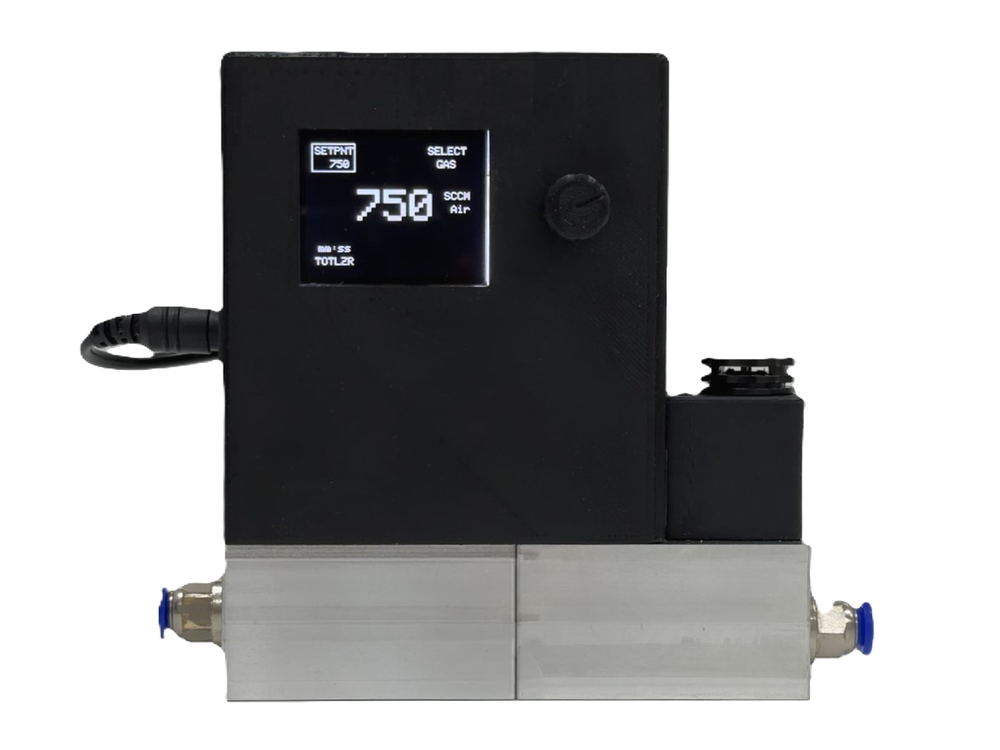

# Mass Flow Controller (MFC) Project

## Overview
The Mass Flow Controller (MFC) Project focuses on the development of a custom electronic PCB and software solution for precise control and monitoring of gas flow rates. The project aims to create an affordable yet high-performance MFC system suitable for various industrial applications.

## Key Objectives
- Design and develop a custom electronic PCB for the MFC system.
- Implement embedded software solutions for accurate flow rate control using Arduino Nano platform.
- Integrate sensors, actuators, and display interfaces for real-time monitoring and user interaction.
- Optimize the MFC system for cost-effectiveness and performance without compromising quality.

## Project Details
- **Electronic PCB Design:** Developed a custom electronic PCB for the MFC system, incorporating components for flow sensing, control, and communication.
- **Embedded Software Development:** Implemented embedded software using C++ programming language on the Arduino Nano platform. Software functionalities include flow sensor data reading, PID calculation, and solenoid valve control.
- **User Interface Design:** Integrated a TFT LCD screen and rotary encoder for user interaction and data visualization. Designed a user-friendly interface for controlling the MFC system parameters.
- **Testing and Optimization:** Conducted rigorous testing and optimization to ensure precise flow control and system reliability. Optimized the MFC system to achieve competitive performance at a lower cost compared to existing solutions.

## Future Work
- Explore additional features and functionalities to enhance the capabilities of the MFC system.
- Collaborate with industry partners to integrate the MFC system into specific industrial applications.
- Continuously monitor and improve system performance and reliability based on user feedback and testing results.